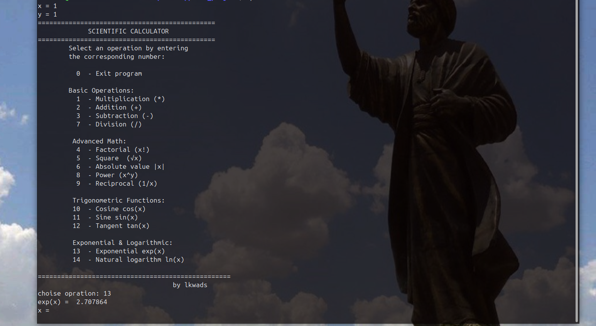

<h1>Project Title</h1>

<h3>Scientific Calculator in C Without math.h Library</h1>

<h2>Project Description</h2>

This project consists of developing a scientific calculator using the C programming language, implemented without using the standard mathematical library (math.h).
All mathematical functions are manually implemented using numerical methods, polynomial approximations, and bit-level manipulations, making this project both educational and low-level oriented.

The calculator runs in console mode and allows the user to perform a wide range of basic and advanced mathematical operations through an interactive menu.

<h2>Objectives</h2>

Understand how mathematical functions work internally

Implement scientific functions without relying on built-in libraries

Apply numerical methods such as Taylor series and Newton–Raphson method

Practice floating-point manipulation and bitwise operations

Strengthen skills in C programming and algorithmic thinking

<h2>Features</h2>
<h3>1. Basic Arithmetic Operations</h3>

Addition

Subtraction

Multiplication

Division (with division-by-zero protection)

<h3>2. Advanced Mathematical Operations</h3>

Factorial

Power function (xⁿ)

Absolute value

Reciprocal (1/x)

Root calculation of any order using Newton–Raphson method

<h3>3. Trigonometric Functions</h3>

Sine (sin x)

Cosine (cos x)

Tangent (tan x = sin x / cos x)

All trigonometric functions are implemented using Taylor series approximation with angle normalization.

<h3>4. Exponential and Logarithmic Functions</h3>

Exponential function exp(x)

Natural logarithm ln(x)

<h2>These functions are implemented using:</h2>

Polynomial approximations

Floating-point exponent and mantissa extraction

Binary manipulation of IEEE-754 floating-point format

Algorithms and Methods Used

Taylor Series Approximation for sin(x) and cos(x)

Polynomial approximation for exp(x)

Newton–Raphson Method for root calculation

Bitwise floating-point manipulation for logarithm computation

Iterative methods for factorial and power functions

Error Handling

Division by zero detection

Domain validation for ln(x), √x, inverse(x)

Protection against invalid operations

<h2>how to use it</h2>
  gcc main.c -o main

  ./main
 <h3>Screenshot</h3>
  

## 📊 Functions Output (Same x value)
### with my code sin(x), cos(x), exp(x), ln(x):

| value/fonctions  | 0 |   0.5  |    1   |   1.5  |    2    |   2.5   |    3    |
|------------------|---|--------|--------|--------|---------|---------|---------|
|    sin(x)        | 0 |0.479426|0.841468|0.997391|0.907937 | 0.588534| 0.091071|
|    cos(x)        | 1 |0.877583|0.540303|0.070753|-0.415873|-0.798636|-0.974777|
|    exp(x)        | 1 | 1.6250 |2.707864| 4.48068| 7.208092|12.071945 |20.052305|
|  log(x)           | --- |-0.692711| 0.000436| 0.405885|0.693583|0.916168|1.099032|

### with my code x^y, sq(x,order):

| x/y             | 0 |   1  |    2   |   3  |    4    |   5  |
|-----------------|---|--------|--------|--------|---------|---------|
|    x^y (x=2)    | 1 |2.0000|4.0000|8.0000|16.0000 | 32.00000|
|  sq(x=2,y)      | 0 |2.0000|1.5000|1.289164|1.270033|1.242669|

### with math.h :
| value/fonctions | 0        | 0.5       | 1        | 1.5      | 2         | 2.5       | 3         |
| --------------- | -------- | --------- | -------- | -------- | --------- | --------- | --------- |
| sin(x)          | 0.000000 | 0.479426  | 0.841471 | 0.997495 | 0.909297  | 0.598472  | 0.141120  |
| cos(x)          | 1.000000 | 0.877583  | 0.540302 | 0.070737 | -0.416147 | -0.801144 | -0.989992 |
| exp(x)          | 1.000000 | 1.648721  | 2.718282 | 4.481689 | 7.389056  | 12.182494 | 20.085537 |
| ln(x)           | ---      | -0.693147 | 0.000000 | 0.405465 | 0.693147  | 0.916291  | 1.098612  |
### power x^y
| x/y       | 0       | 1       | 2       | 3       | 4        | 5        |
| --------- | ------- | ------- | ------- | ------- | -------- | -------- |
| x^y (x=2) | 1.00000 | 2.00000 | 4.00000 | 8.00000 | 16.00000 | 32.00000 |

### square not just  square root(1/2) :
| x/y       | 1/2      | 1/3      | 1/4      | 1/5      |
| --------- | -------- | -------- | -------- | -------- |
| x^y (x=2) | 1.414214 | 1.259921 | 1.189207 | 1.148699 |

<h2>Conclusion</h2>

This scientific calculator is a complete and educational implementation that reproduces core mathematical functions from scratch.
By avoiding math.h, the project highlights how complex mathematical operations can be built using algorithms, approximations, and binary arithmetic, making it a strong example of applied computer science and numerical computing.
